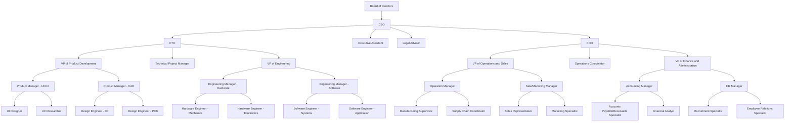

# Organizational Chart

## Board of Directors
- **CEO (Chief Executive Officer)**
  - Overall leadership and strategic direction of the company.
  
- **CTO (Chief Technology Officer)**
  - Oversees technology strategy, product development, and engineering functions.
    - **Technical Project Manager**
      - Manages technology projects, ensuring alignment with strategic goals and timely delivery.

- **COO (Chief Operating Officer)**
  - Manages day-to-day operations and ensures operational efficiency.
    - **Operations Coordinator**
      - Supports daily operations, coordinates tasks across departments, and enhances workflow efficiency.

## Executive Team

### CEO Office
- **Executive Assistant**
  - Provides administrative support to the CEO, managing schedules and communications.
  
- **Legal Advisor**
  - Offers legal guidance and ensures compliance with regulations.

### Technical Leadership
- **VP of Product Development**
  - Oversees product lifecycle from concept to launch.
    - **Product Manager (UI/UX)**
      - Manages user experience design and user research.
        - UI Designer
          - Designs user interfaces for products.
        - UX Researcher
          - Conducts research to inform design decisions.
    
    - **Product Manager (CAD)**
      - Oversees hardware design and PCB development.
        - Design Engineer (3D)
          - Designs hardware components using CAD software.
        - Design Engineer (PCB)
          - Develops printed circuit board layouts.

- **VP of Engineering**
  - Leads engineering teams in developing innovative solutions.
    - **Engineering Manager (Hardware)**
      - Oversees hardware engineering efforts.
        - Hardware Engineer (Mechanics)
          - Designs mechanical systems for products.
        - Hardware Engineer (Electronics)
          - Develops electronic components and systems.
    
    - **Engineering Manager (Software)**
      - Leads software development for robotic systems.
        - Software Engineer (Systems)
          - Develops system-level software for robotics.
        - Software Engineer (Application)
          - Creates application-level software for user interaction.

### Operations and Finance
- **VP of Operations and Sales**
  - Manages operational activities and sales strategies.
    - **Operations Manager**
      - Oversees manufacturing processes and supply chain management.
        - Manufacturing Supervisor
          - Manages production teams and schedules.
        - Supply Chain Coordinator
          - Coordinates logistics and inventory management.

    - **Sales and Marketing Manager**
      - Develops sales strategies and oversees marketing initiatives.
        - Sales Representatives
          - Engages customers and drives sales efforts.
        - Marketing Specialist
          - Implements marketing campaigns to promote products.

- **VP of Finance and Administration**
  - Oversees financial operations and administrative functions.
    - **Accounting Manager**
      - Manages financial reporting, budgets, and compliance.
        - Accounts Payable/Receivable Specialist
          - Handles all incoming and outgoing payments.
        - Financial Analyst
          - Analyzes financial data to support decision-making.

    - **HR Manager**
      - Manages recruitment, employee relations, and HR strategy.
        - Recruitment Specialist
          - Handles talent acquisition processes.
        - Employee Relations Specialist
          - Manages employee engagement and conflict resolution.

